# Infraestrutura de Persistência com Docker

## Aluna

Maria Eduarda de Araújo Silva

## 1. Introdução

Esta atividade tem como objetivo demonstrar, na prática, o funcionamento da persistência de dados em ambientes conteinerizados utilizando Docker.

Por padrão, containers são efêmeros. Isso significa que, quando um container é removido, os dados gravados apenas dentro do seu sistema de arquivos interno também podem ser perdidos. Para evitar esse problema, o Docker permite utilizar mecanismos de persistência, como volumes nomeados e bind mounts.

Volumes Docker são gerenciados pelo próprio Docker e são indicados para armazenar dados de serviços como bancos de dados. Bind mounts permitem montar um diretório do sistema operacional host dentro de um container, sendo bastante utilizados em ambientes de desenvolvimento.

A atividade foi dividida em cinco cenários práticos:

- Persistência de dados com MySQL e volume nomeado.
- Backup e restauração de volume.
- Bind mount para desenvolvimento.
- Compartilhamento de dados entre containers.
- Automação de backup com script Bash.

## 2. Ambiente Utilizado

| Item | Informação |
|---|---|
| Sistema Operacional | Ubuntu Linux em VM Oracle VirtualBox |
| Docker Engine | Docker version 29.1.3, build 29.1.3-0ubuntu3~24.04.1 |
| Docker Compose | Docker Compose version v2.27.0 |
| Git | git version 2.43.0 |
| Terminal | Terminal Linux |
| Editor de texto | Nano |
| Repositório GitHub | `infra-persistencia-docker` |

> Observação: para validar a versão exata do Ubuntu e os dados de hardware da VM, podem ser utilizados os comandos abaixo:

```bash
lsb_release -a
nproc
free -h
df -h /
```

## 3. Verificações Obrigatórias Antes do Início

Antes da execução dos cenários, foram validadas as ferramentas obrigatórias.

```bash
docker --version
docker compose version
git --version
docker run hello-world
```

Resultado esperado:

- O comando `docker --version` deve retornar a versão instalada do Docker.
- O comando `docker compose version` deve retornar a versão do plugin Docker Compose.
- O comando `git --version` deve retornar a versão instalada do Git.
- O comando `docker run hello-world` deve baixar e executar a imagem `hello-world`, confirmando que o Docker está funcionando corretamente.

### Evidências do ambiente

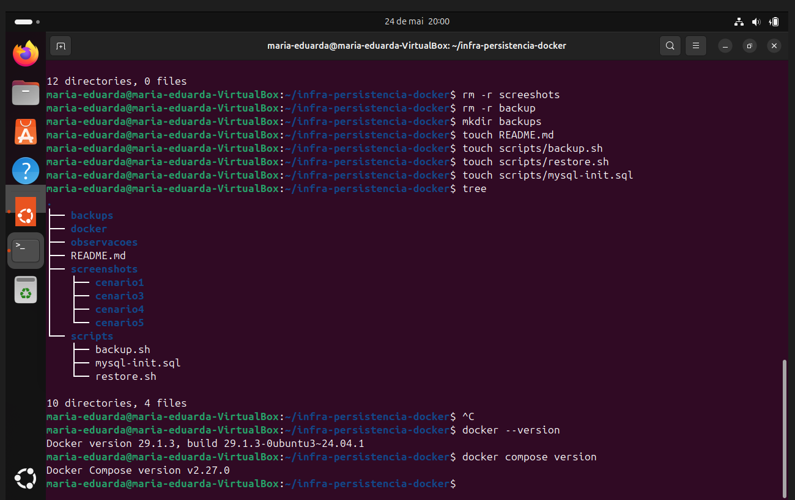


## 4. Estrutura do Projeto

A estrutura utilizada no repositório foi organizada da seguinte forma:

```text
infra-persistencia-docker/
├── README.md
├── scripts/
│   ├── backup.sh
│   ├── restore.sh
│   └── mysql-init.sql
├── screenshots/
│   ├── ambiente/
│   ├── cenario1/
│   ├── cenario2/
│   ├── cenario3/
│   ├── cenario4/
│   └── cenario5/
├── backups/
├── docker/
└── observacoes/
```

## 5. Desenvolvimento da Atividade

---

# Cenário 1 - Persistência de Dados com MySQL e Named Volume

## Objetivo

Validar que os dados armazenados em um banco MySQL permanecem disponíveis mesmo após a remoção e recriação do container, desde que o mesmo volume nomeado seja reutilizado.

## Comandos executados

### 1. Criar volume nomeado

```bash
docker volume create mysql-prod-data
```

### 2. Criar container MySQL utilizando o volume

```bash
docker run -d \
  --name mysql-prod \
  -e MYSQL_ROOT_PASSWORD=123456 \
  -e MYSQL_DATABASE=empresa \
  -v mysql-prod-data:/var/lib/mysql \
  mysql:8.0
```

### 3. Validar container em execução

```bash
docker ps
```

### 4. Acessar o MySQL

```bash
docker exec -it mysql-prod mysql -u root -p
```

### 5. Criar tabela e inserir registros

```sql
USE empresa;

CREATE TABLE usuarios (
  id INT AUTO_INCREMENT PRIMARY KEY,
  nome VARCHAR(100),
  email VARCHAR(100)
);

INSERT INTO usuarios (nome, email) VALUES
('Maria Silva', 'maria@email.com'),
('Joao Souza', 'joao@email.com'),
('Ana Lima', 'ana@email.com');

SELECT * FROM usuarios;
```

### 6. Remover o container

```bash
docker stop mysql-prod
docker rm mysql-prod
```

### 7. Recriar o container usando o mesmo volume

```bash
docker run -d \
  --name mysql-prod \
  -e MYSQL_ROOT_PASSWORD=123456 \
  -e MYSQL_DATABASE=empresa \
  -v mysql-prod-data:/var/lib/mysql \
  mysql:8.0
```

### 8. Validar persistência dos dados

```bash
docker exec -it mysql-prod mysql -u root -p
```

```sql
USE empresa;
SELECT * FROM usuarios;
```

## Explicação técnica

O volume `mysql-prod-data` foi montado no caminho `/var/lib/mysql`, que é o diretório onde o MySQL armazena seus arquivos internos de banco de dados. Mesmo removendo o container, o volume permaneceu existente no Docker. Ao criar um novo container utilizando o mesmo volume, os dados continuaram disponíveis.

## Evidências

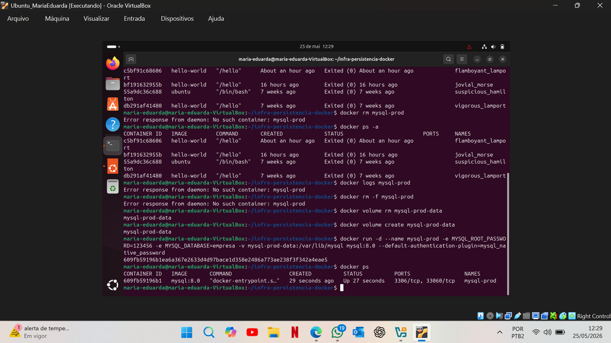

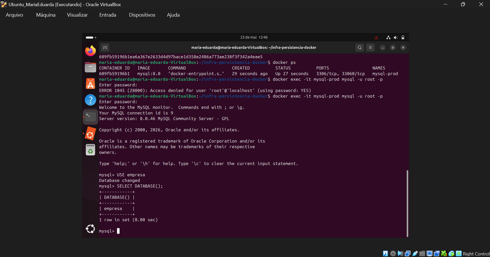

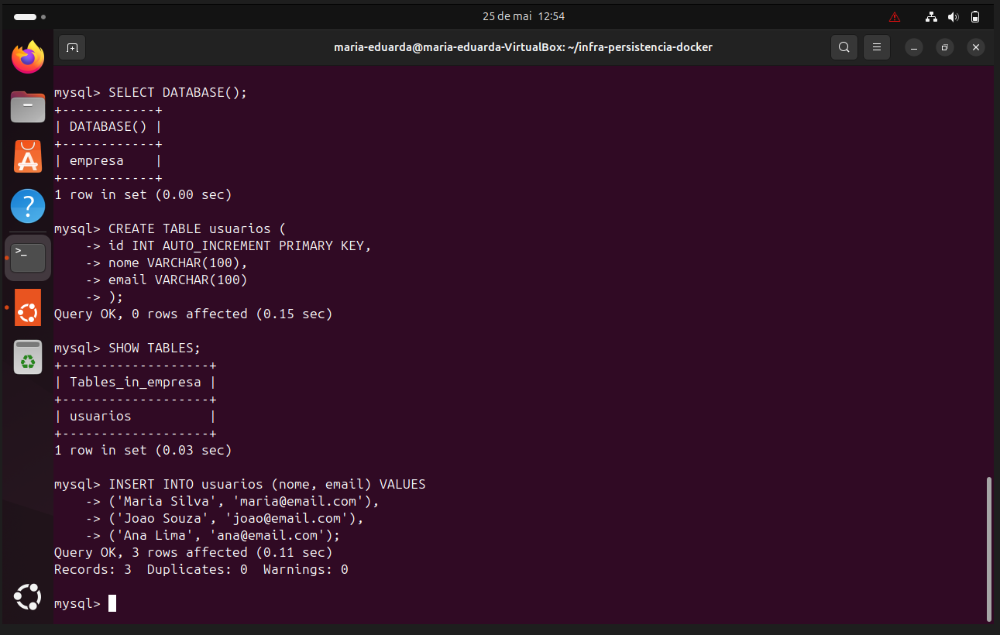

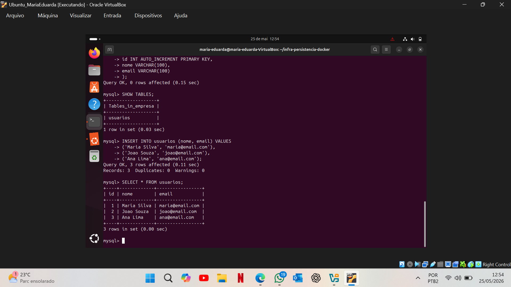

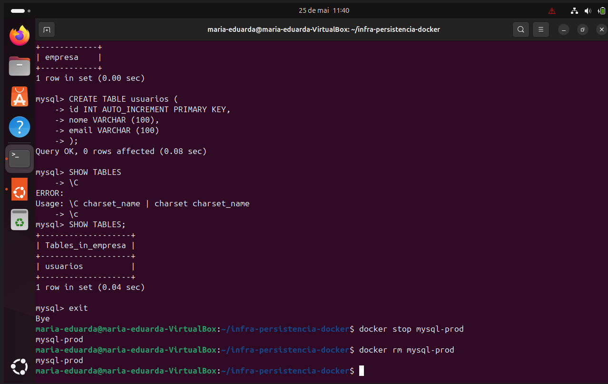


## Conclusão do cenário

A persistência foi validada com sucesso. Os dados inseridos na tabela `usuarios` permaneceram disponíveis após a remoção e recriação do container MySQL.

---

# Cenário 2 - Backup e Restauração de Volume

## Objetivo

Compreender estratégias de backup e recuperação de dados utilizando backup compactado do volume Docker e exportação lógica com `mysqldump`.

## Comandos executados

### 1. Criar backup compactado do volume `.tar.gz`

```bash
docker run --rm \
  -v mysql-prod-data:/data \
  -v $(pwd)/backups:/backup \
  ubuntu \
  tar czf /backup/mysql-backup.tar.gz -C /data .
```

### 2. Executar backup lógico com mysqldump

```bash
docker exec mysql-prod mysqldump -u root -p empresa > backups/empresa.sql
```

Validar se o arquivo foi criado:

```bash
ls -lh backups/
```

### 3. Simular perda do volume

Antes de remover o volume, foi necessário parar e remover o container que estava utilizando esse volume.

```bash
docker stop mysql-prod
docker rm mysql-prod
docker volume rm mysql-prod-data
```

### 4. Recriar o volume

```bash
docker volume create mysql-prod-data
```

### 5. Restaurar backup `.tar.gz`

```bash
docker run --rm \
  -v mysql-prod-data:/data \
  -v $(pwd)/backups:/backup \
  ubuntu \
  bash -c "cd /data && tar xzf /backup/mysql-backup.tar.gz"
```

### 6. Subir novamente o MySQL com o volume restaurado

```bash
docker run -d \
  --name mysql-prod \
  -e MYSQL_ROOT_PASSWORD=123456 \
  -e MYSQL_DATABASE=empresa \
  -v mysql-prod-data:/var/lib/mysql \
  mysql:8.0
```

### 7. Validar dados restaurados

```bash
docker exec -it mysql-prod mysql -u root -p
```

```sql
USE empresa;
SELECT * FROM usuarios;
```

## Explicação técnica

O backup `.tar.gz` copia os arquivos físicos do volume Docker. Essa abordagem permite restaurar o estado do volume como estava no momento da compactação. O `mysqldump`, por outro lado, gera uma cópia lógica do banco em formato SQL, permitindo recriar banco, tabelas e registros por comandos SQL.

## Evidências

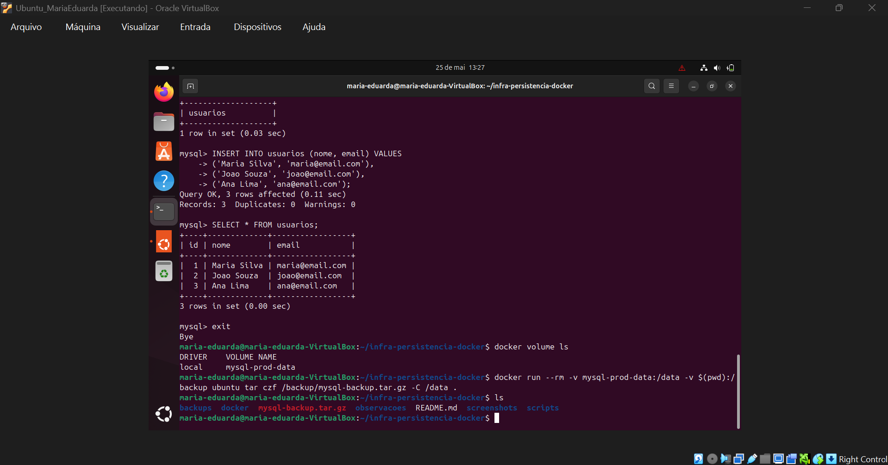

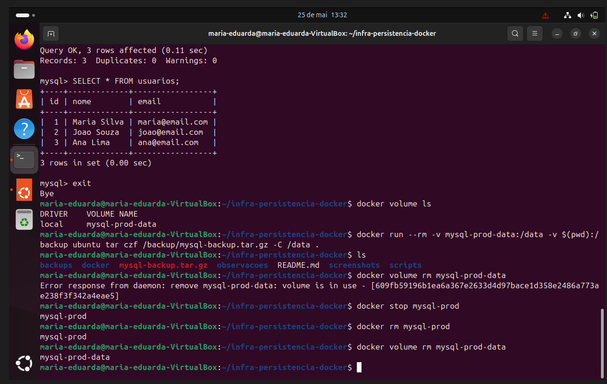

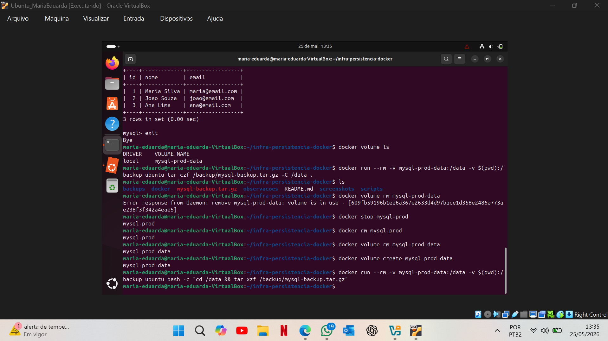

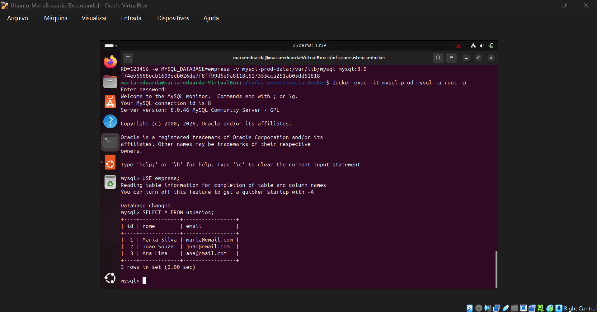

> Evidência pendente recomendada: adicionar print do comando `mysqldump` e da listagem `ls -lh backups/empresa.sql`, pois o professor solicitou explicitamente backup `.tar.gz` e `mysqldump`.

## Conclusão do cenário

Foi possível criar backup do volume, simular perda de dados, restaurar o volume e validar que os dados do MySQL continuaram acessíveis após a restauração.

---

# Cenário 3 - Bind Mount e Desenvolvimento

## Objetivo

Compreender o funcionamento de bind mounts, montando um diretório local do host dentro de um container.

## Comandos executados

### 1. Criar diretório local

```bash
mkdir bind-demo
cd bind-demo
```

### 2. Criar arquivo no host

```bash
echo "Arquivo criado no host (Linux)" > index.txt
ls
cat index.txt
```

### 3. Montar diretório local em container Ubuntu

```bash
docker run -it --name bind-container -v $(pwd):/app ubuntu bash
```

### 4. Validar arquivo dentro do container

```bash
cd /app
ls
cat index.txt
```

### 5. Criar conteúdo dentro do container

```bash
echo "Arquivo criado dentro do container" >> index.txt
cat index.txt
exit
```

### 6. Validar alteração no host

```bash
cat index.txt
```

## Explicação técnica

No bind mount, o diretório do host é montado diretamente dentro do container. Nesse cenário, o diretório local foi montado no caminho `/app`. Qualquer alteração feita no host apareceu no container, e qualquer alteração feita no container apareceu no host.

## Evidências

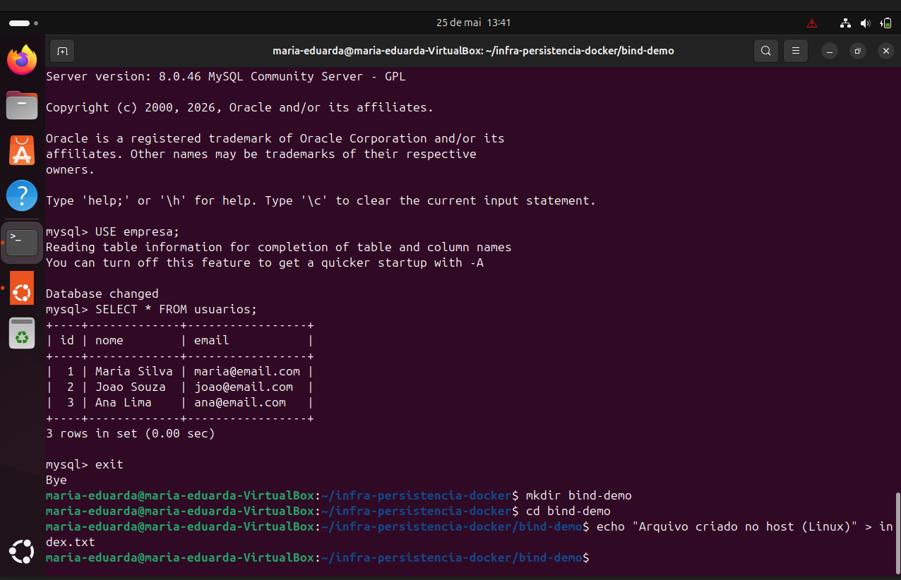

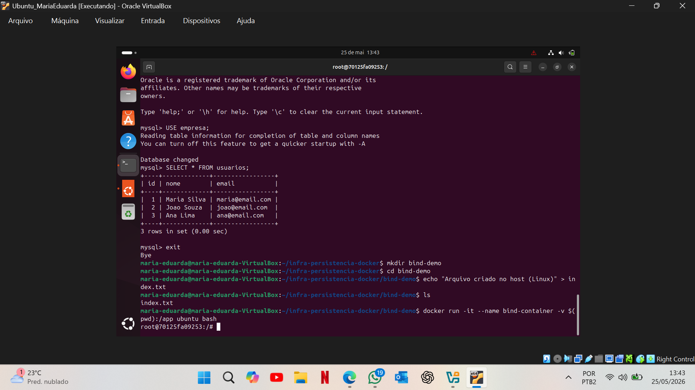

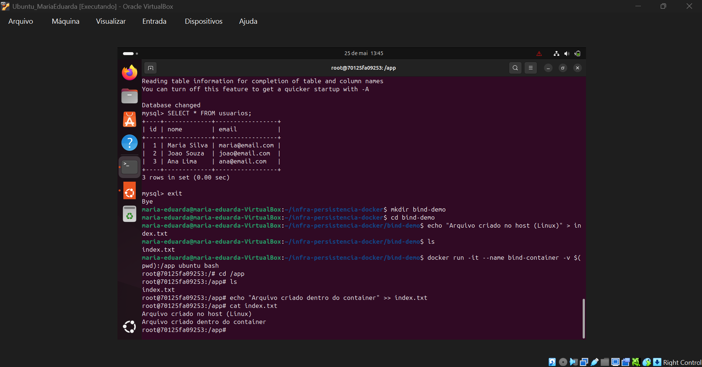


## Diferença entre host e container

O host é o sistema operacional principal onde o Docker está instalado. O container é o ambiente isolado criado a partir de uma imagem. Com o bind mount, um diretório do host fica disponível dentro do container.

## Conclusão do cenário

O bind mount foi validado com sucesso, demonstrando sincronização em tempo real entre o diretório local e o container.

---

# Cenário 4 - Compartilhamento de Dados Entre Containers

## Objetivo

Compreender como dois ou mais containers podem compartilhar dados utilizando o mesmo volume Docker.

## Comandos executados

### 1. Criar volume compartilhado

```bash
docker volume create shared-data
```

### 2. Criar container produtor

```bash
docker run -dit --name container-produto -v shared-data:/data ubuntu bash
```

### 3. Criar container consumidor

```bash
docker run -dit --name container-consumidor -v shared-data:/data ubuntu bash
```

### 4. Produtor cria arquivo no volume

```bash
docker exec -it container-produto bash
cd /data
echo "Mensagem criada pelo PRODUTOR" > dados.txt
cat dados.txt
exit
```

### 5. Consumidor lê arquivo criado pelo produtor

```bash
docker exec -it container-consumidor bash
cd /data
cat dados.txt
```

### 6. Consumidor escreve no mesmo arquivo

```bash
echo "Mensagem criada pelo CONSUMIDOR" >> dados.txt
cat dados.txt
exit
```

### 7. Produtor valida alteração do consumidor

```bash
docker exec -it container-produto bash
cat /data/dados.txt
exit
```

## Explicação técnica

O volume `shared-data` foi montado no caminho `/data` em dois containers diferentes. Como ambos utilizavam o mesmo volume Docker, os arquivos criados ou alterados por um container ficaram imediatamente disponíveis para o outro.

## Evidências

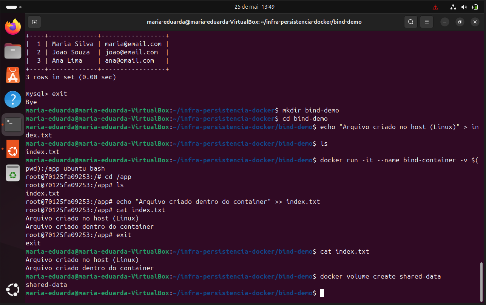


## Conclusão do cenário

O compartilhamento de dados entre containers foi validado com sucesso, demonstrando que volumes Docker podem ser utilizados por múltiplos containers simultaneamente.

---

# Cenário 5 - Automação de Backup

## Objetivo

Introduzir automação operacional em infraestrutura por meio de um script Bash responsável por gerar backup compactado de um volume Docker.

## Script utilizado

Arquivo: `scripts/backup.sh`

```bash
#!/bin/bash

DATA=$(date +%Y-%m-%d_%H-%M-%S)

mkdir -p backups

docker run --rm \
  -v mysql-prod-data:/data \
  -v $(pwd)/backups:/backup \
  ubuntu \
  tar czf /backup/backup_$DATA.tar.gz -C /data .

echo "Backup criado com sucesso: backup_$DATA.tar.gz"
```

## Comandos executados

### 1. Criar o script

```bash
nano scripts/backup.sh
```

### 2. Permitir execução

```bash
chmod +x scripts/backup.sh
```

### 3. Executar script

```bash
./scripts/backup.sh
```

### 4. Validar backup gerado

```bash
ls -lh backups/
```

## Explicação técnica

O script utiliza a data e hora atual para gerar um nome único para cada arquivo de backup. Em seguida, executa um container Ubuntu temporário, monta o volume `mysql-prod-data` em `/data`, monta a pasta local `backups` em `/backup` e compacta o conteúdo do volume em um arquivo `.tar.gz`.

## Evidências


## Conclusão do cenário

A automação de backup foi validada com sucesso. O script Bash gerou um arquivo compactado com timestamp, facilitando a rotina de backup operacional.

---

# 6. Problemas Encontrados e Troubleshooting

Durante a execução da atividade, alguns problemas foram identificados e resolvidos.

## Problema 1 - Erro de montagem de volume

Ocorreu erro ao informar o caminho do volume de forma incorreta.

### Solução

Foi corrigido o parâmetro `-v`, utilizando o formato correto:

```bash
-v mysql-prod-data:/var/lib/mysql
```

## Problema 2 - Container MySQL em estado `Exited` ou inexistente

Durante os testes, alguns comandos foram executados quando o container não estava ativo ou já havia sido removido.

### Solução

Foi utilizado:

```bash
docker ps -a
docker logs mysql-prod
docker rm -f mysql-prod
```

Depois disso, o container foi criado novamente com o volume correto.

## Problema 3 - Erro de senha no MySQL

Foi identificado erro de acesso ao MySQL quando a senha informada estava incorreta.

### Solução

Foi repetido o acesso com a senha correta definida na variável:

```bash
-e MYSQL_ROOT_PASSWORD=123456
```

## Problema 4 - Erro de sintaxe SQL

Durante a criação da tabela, ocorreram erros de sintaxe SQL.

### Solução

O comando foi corrigido para:

```sql
CREATE TABLE usuarios (
  id INT AUTO_INCREMENT PRIMARY KEY,
  nome VARCHAR(100),
  email VARCHAR(100)
);
```

## Problema 5 - Volume em uso

Ao tentar remover o volume, o Docker retornou que ele ainda estava em uso por um container.

### Solução

Foi necessário parar e remover o container antes de remover o volume:

```bash
docker stop mysql-prod
docker rm mysql-prod
docker volume rm mysql-prod-data
```

# 7. Conclusão

A atividade permitiu demonstrar conceitos essenciais de persistência de dados com Docker. No primeiro cenário, foi validado que volumes nomeados preservam dados mesmo após a remoção de containers. No segundo cenário, foram aplicadas estratégias de backup e restauração utilizando arquivos compactados e backup lógico. No terceiro cenário, foi demonstrado o uso de bind mounts para sincronização entre host e container. No quarto cenário, foi validado o compartilhamento de dados entre containers por meio de volume comum. Por fim, no quinto cenário, foi criado um script Bash para automatizar a geração de backups.

Com isso, foi possível compreender a importância dos volumes Docker, das estratégias de backup e da automação em ambientes de infraestrutura conteinerizada.

